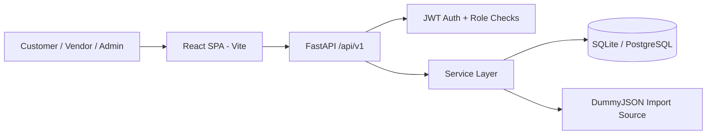

<div align="center">

# Commerce Studio
### Full-Stack E-commerce Platform (FastAPI + React)

Production-oriented e-commerce application with customer storefront, vendor product studio, and admin control panel.


[Backend API](./fastapi) · [Frontend App](./react) · [Deployment Guide](./DEPLOYMENT_GUIDE_RENDER_AWS.md)

</div>

---

## Table of Contents

- [Overview](#overview)
- [Core Features](#core-features)
- [Architecture](#architecture)
- [Folder Structure](#folder-structure)
- [Tech Stack](#tech-stack)
- [Repository Structure](#repository-structure)
- [Getting Started](#getting-started)
- [Environment Configuration](#environment-configuration)
- [Default Demo Accounts](#default-demo-accounts)
- [Role-Based Access](#role-based-access)
- [API Quick Map](#api-quick-map)
- [Product Import Workflows](#product-import-workflows)
- [Payment Model](#payment-model)
- [Testing](#testing)
- [Docker](#docker)
- [Deployment](#deployment)
- [Useful Management Commands](#useful-management-commands)
- [Documentation Files](#documentation-files)
- [Contributing](#contributing)
- [License](#license)

---

## Overview

This repository contains a complete commerce system with:

- `fastapi/` backend API (JWT auth, SQLAlchemy models, Alembic migrations, tests)
- `react/` frontend SPA (storefront + vendor + admin experiences)
- production-focused middleware and deployment docs (Render + AWS)

The backend defaults to SQLite for local development and supports PostgreSQL in production via `DATABASE_URL`.

---

## Core Features

- Customer flows:
  - Register/login (email or username)
  - Browse catalog, search/filter products, view details and reviews
  - Add to cart, checkout, view orders, pay orders
  - Manage profile and saved addresses
- Vendor/Admin flows:
  - Create and manage products
  - Bulk import products from DummyJSON or pasted JSON
- Admin flows:
  - Manage users, categories, coupons, and order payment actions
- Payments:
  - Built-in free gateways: `manual_free`, `mock_free`
  - Tax is applied at payment time, not at checkout
- Backend quality:
  - Security headers middleware (CSP, X-Frame-Options, etc.)
  - Health and readiness endpoints
  - Alembic migrations and CLI management commands
  - Automated test suite (47 tests passing in local run)

---

## Architecture



Main data artifacts:

- ERD design: [`schema.drawio`](./schema.drawio)
- Sample import payloads:
  - [`dummyjson_products_sample.json`](./dummyjson_products_sample.json)
  - [`fastapi/sample_dummyjson_products.json`](./fastapi/sample_dummyjson_products.json)

---
### Folder Structure

```
ecom/
│
├── README.md
├── DEPLOYMENT_GUIDE_RENDER_AWS.md
├── schema.drawio
├── dummyjson_products_sample.json
├── presentation.md
│
├── fastapi/                         # Backend API
│   │
│   ├── manage.py
│   ├── Dockerfile
│   ├── alembic.ini
│   ├── requirements.txt
│   ├── requirements-dev.txt
│   ├── sample_dummyjson_products.json
│   ├── README.md
│   │
│   ├── alembic/
│   │   └── versions/
│   │
│   ├── tests/                       # Backend test suite
│   │
│   └── app/                         # Application Package
│       │
│       ├── main.py                  # FastAPI entry point
│       │
│       ├── api/
│       │   ├── deps.py
│       │   ├── router.py
│       │   └── v1/
│       │       └── endpoints/
│       │           ├── auth.py
│       │           ├── users.py
│       │           ├── addresses.py
│       │           ├── products.py
│       │           ├── categories.py
│       │           ├── reviews.py
│       │           ├── cart.py
│       │           ├── orders.py
│       │           ├── coupons.py
│       │           └── health.py
│       │
│       ├── core/
│       │   ├── config.py
│       │   ├── security.py
│       │   └── middleware.py
│       │
│       ├── db/
│       │   ├── base.py
│       │   ├── session.py
│       │   └── init_db.py
│       │
│       ├── models/
│       │   ├── user.py
│       │   ├── address.py
│       │   ├── category.py
│       │   ├── product.py
│       │   ├── inventory.py
│       │   ├── cart.py
│       │   ├── order.py
│       │   └── review.py
│       │
│       ├── schemas/
│       │   ├── auth.py
│       │   ├── user.py
│       │   ├── address.py
│       │   ├── product.py
│       │   ├── category.py
│       │   ├── cart.py
│       │   ├── order.py
│       │   ├── payment.py
│       │   ├── coupon.py
│       │   ├── review.py
│       │   ├── importer.py
│       │   └── common.py
│       │
│       └── services/
│           ├── cart.py
│           ├── order.py
│           ├── payment.py
│           └── product_import.py
│
└── react/                           # Frontend SPA
    │
    ├── package.json
    ├── package-lock.json
    ├── vite.config.js
    ├── index.html
    └── README.md
    │
    └── src/
        │
        ├── main.jsx
        ├── App.jsx
        ├── styles.css
        │
        ├── components/
        │   ├── AppShell.jsx
        │   ├── AdminShell.jsx
        │   ├── ProtectedRoute.jsx
        │   ├── ProductCard.jsx
        │   └── StatusPill.jsx
        │
        ├── context/
        │   └── AuthContext.jsx
        │
        ├── lib/
        │   ├── api.js
        │   └── format.js
        │
        └── pages/
            │
            ├── HomePage.jsx
            ├── CatalogPage.jsx
            ├── ProductPage.jsx
            ├── CartPage.jsx
            ├── CheckoutPage.jsx
            ├── OrdersPage.jsx
            ├── OrderDetailPage.jsx
            ├── ProfilePage.jsx
            ├── LoginPage.jsx
            ├── RegisterPage.jsx
            ├── NotFoundPage.jsx
            │
            ├── admin/
            │   ├── AdminDashboardPage.jsx
            │   ├── AdminUsersPage.jsx
            │   ├── AdminProductsPage.jsx
            │   ├── AdminOrdersPage.jsx
            │   ├── AdminCategoriesPage.jsx
            │   └── AdminCouponsPage.jsx
            │
            └── vendor/
                └── VendorProductsPage.jsx
```


---

## Tech Stack

| Layer | Tech |
| --- | --- |
| Backend API | FastAPI, Uvicorn |
| ORM + Migrations | SQLAlchemy 2, Alembic |
| Auth | JWT (`python-jose`), password hashing (`passlib`) |
| Database | SQLite (local default), PostgreSQL-compatible via `DATABASE_URL` |
| Frontend | React 18, React Router 6, Vite 5 |
| Testing | Pytest, FastAPI TestClient, HTTPX |
| Containerization | Docker |

---

## Repository Structure

```text
ecom/
├── README.md
├── DEPLOYMENT_GUIDE_RENDER_AWS.md
├── schema.drawio
├── dummyjson_products_sample.json
├── presentation.md
├── fastapi/
│   ├── app/
│   │   ├── api/v1/endpoints/        # auth, users, addresses, products, cart, orders...
│   │   ├── core/                    # settings, security, middleware
│   │   ├── db/                      # session + seed helpers
│   │   ├── models/                  # SQLAlchemy models
│   │   ├── schemas/                 # Pydantic request/response models
│   │   └── services/                # cart/order/payment/import logic
│   ├── alembic/                     # migration config + versions
│   ├── tests/                       # backend test suite
│   ├── manage.py                    # run/migrate/seed/import/check commands
│   ├── Dockerfile
│   └── README.md
└── react/
    ├── src/
    │   ├── pages/                   # storefront + admin/vendor pages
    │   ├── components/
    │   ├── context/AuthContext.jsx
    │   └── lib/api.js               # centralized API client
    ├── package.json
    └── README.md
```

---

## Getting Started

### Prerequisites

- Python 3.10+ (3.12 used in Dockerfile)
- Node.js 20+ and npm

### 1) Clone

```bash
git clone https://github.com/samuelpondugala/fastapi-react-ecom.git
cd fastapi-react-ecom
```


## Getting Started

### Prerequisites

- Python 3.10+ (3.12 used in Dockerfile)
- Node.js 20+ and npm

### 1) Clone

```bash
git clone https://github.com/samuelpondugala/fastapi-react-ecom.git
cd fastapi-react-ecom
```

### 2) Backend setup

```bash
cd fastapi
python -m venv .venv
source .venv/bin/activate
pip install -r requirements.txt
```

Create `fastapi/.env`:

```env
APP_NAME=Ecom API
APP_ENV=dev
DEBUG=false
API_V1_PREFIX=/api/v1
ENABLE_DOCS=true

DATABASE_URL=sqlite:///./ecom.db
SQL_ECHO=false

JWT_SECRET_KEY=change-this-in-production
JWT_ALGORITHM=HS256
ACCESS_TOKEN_EXPIRE_MINUTES=60

DEFAULT_ADMIN_EMAIL=admin@example.com
DEFAULT_ADMIN_PASSWORD=Admin@1234
SEED_DEMO_USERS=true
```

Apply schema and seed users:

```bash
python manage.py upgrade head
python manage.py seed
python manage.py run --reload --host 0.0.0.0 --port 8000
```

Backend URLs:

- Swagger: `http://localhost:8000/docs`
- OpenAPI JSON: `http://localhost:8000/openapi.json`
- Health: `http://localhost:8000/api/v1/health`


### 3) Frontend setup

In a second terminal:

```bash
cd react
npm install
```

Create `react/.env`:

```env
VITE_API_BASE_URL=http://localhost:8000/api/v1
```

Run frontend:

```bash
npm run dev
```

Frontend URL: `http://localhost:5173`

---

## Environment Configuration

### Backend (`fastapi/.env`)

Important variables:

| Variable | Default | Notes |
| --- | --- | --- |
| `APP_ENV` | `dev` | Use `production` in prod |
| `DEBUG` | `false` | Must be boolean (`true`/`false`) |
| `DATABASE_URL` | `sqlite:///./ecom.db` | Set Postgres URL for production |
| `JWT_SECRET_KEY` | `change-this-in-production` | Must change in production |
| `DEFAULT_ADMIN_PASSWORD` | `Admin@1234` | Must change in production |
| `CORS_ORIGINS` | localhost defaults | Comma-separated allowed frontend origins |
| `ALLOWED_HOSTS` | `*` | Restrict in production |
| `ENABLE_HTTPS_REDIRECT` | `false` | Enable behind TLS |
| `SEED_DEMO_USERS` | `true` | Set `false` in production |

Production validation is enforced in settings. Startup will fail in production mode if insecure defaults are used.

### Frontend (`react/.env`)

| Variable | Default |
| --- | --- |
| `VITE_API_BASE_URL` | `http://localhost:8000/api/v1` |

---

## Default Demo Accounts

Created by `python manage.py seed` when `SEED_DEMO_USERS=true`:

- Admin: `ecomadmin` / `ecom@123admin`
- Vendor: `ecomvendor` / `ecom@123vendor`

These are for local/demo use only.

---

## Role-Based Access

| Role | Capabilities |
| --- | --- |
| `customer` | shop, cart, checkout, pay own orders, profile/addresses, reviews |
| `vendor` | all customer capabilities + create/import/update products (`/vendor/products`) |
| `admin` | all vendor capabilities + users/categories/coupons/admin order center |

Frontend protected routes:

- Public: `/`, `/catalog`, `/products/:productId`, `/login`, `/register`
- Authenticated: `/cart`, `/checkout`, `/orders`, `/orders/:orderId`, `/profile`
- Vendor/Admin: `/vendor/products`
- Admin only: `/admin`, `/admin/users`, `/admin/categories`, `/admin/products`, `/admin/coupons`, `/admin/orders`

---

## API Quick Map

All endpoints are under `http://localhost:8000/api/v1`.

- Health:
  - `GET /health`
  - `GET /health/ready`
- Auth:
  - `POST /auth/register`
  - `POST /auth/login`
  - `GET /auth/me`
- Users/Addresses:
  - `GET /users`, `GET /users/{id}`, `PATCH /users/me`
  - `GET/POST/PATCH/DELETE /addresses/me...`
- Catalog:
  - `GET/POST/PATCH /categories...`
  - `GET/POST/PATCH /products...`
  - `POST /products/import/dummyjson`
  - `POST /products/import/json`
  - `GET /reviews/product/{product_id}`
  - `POST /reviews`
- Cart/Orders/Payments:
  - `GET /cart/me`
  - `POST /cart/items`
  - `PATCH /cart/items/{item_id}`
  - `DELETE /cart/items/{item_id}`
  - `DELETE /cart/clear`
  - `POST /orders/checkout`
  - `GET /orders/me`
  - `GET /orders/{order_id}`
  - `GET /orders/payment-gateways/free`
  - `POST /orders/{order_id}/payment/quote`
  - `POST /orders/{order_id}/pay`
- Coupons:
  - `GET /coupons`
  - `POST /coupons` (admin only)

Use Swagger at `/docs` for full schema and live request testing.

---

## Product Import Workflows

### CLI import

```bash
cd fastapi
source .venv/bin/activate

# from dummyjson.com
python manage.py import-products --from-dummyjson --limit 20 --skip 0

# from local JSON file
python manage.py import-products --file sample_dummyjson_products.json
```

### API import

- `POST /products/import/dummyjson`
- `POST /products/import/json`

### Frontend import

- Vendor/Admin page: `/vendor/products` or `/admin/products`
- Supports:
  - direct import from DummyJSON
  - pasted JSON import (`{"products":[...]}` or list payload)

---

## Payment Model

- Free gateways:
  - `manual_free` (success path)
  - `mock_free` (supports failure simulation)
- Tax behavior:
  - checkout keeps tax at `0.00`
  - tax is calculated and applied during payment (`/orders/{id}/pay`)
- Quote endpoint:
  - `POST /orders/{id}/payment/quote`
  - supports `tax_mode`: `none`, `fixed`, `percent`

---

## Testing

Backend tests:

```bash
cd fastapi
source .venv/bin/activate
pip install -r requirements-dev.txt
pytest
```

Current local verification in this repo state:

- `47 passed` (`fastapi/tests`, run date: 2026-03-09)
- Frontend production build succeeds with `npm run build`

If your shell exports non-boolean `DEBUG` value, set a valid value before running tests:

```bash
export DEBUG=false
```

---

## Docker

Backend container:

```bash
cd fastapi
docker build -t ecom-api .
docker run --rm -p 8000:8000 --env-file .env ecom-api
```

Entrypoint behavior:

- Runs migrations automatically when `RUN_DB_MIGRATIONS=true` (default)
- Optional seeding via `RUN_SEED=true`

---

## Deployment

Detailed deployment runbook:

- [`DEPLOYMENT_GUIDE_RENDER_AWS.md`](./DEPLOYMENT_GUIDE_RENDER_AWS.md)

Covers:

- Render deployment (Postgres + backend + frontend static site)
- AWS deployment (ECR + App Runner + RDS + frontend hosting options)
- production env planning, CORS/hosts, TLS, operational checklist

---

## Useful Management Commands

```bash
cd fastapi
source .venv/bin/activate

python manage.py run --reload
python manage.py check
python manage.py upgrade head
python manage.py downgrade -1
python manage.py revision -m "your migration" --autogenerate
python manage.py seed
python manage.py import-products --from-dummyjson --limit 20 --skip 0
```

---

## Documentation Files

- Root project summary: [`README.md`](./README.md)
- Backend details: [`fastapi/README.md`](./fastapi/README.md)
- Frontend details: [`react/README.md`](./react/README.md)
- Deployment guide: [`DEPLOYMENT_GUIDE_RENDER_AWS.md`](./DEPLOYMENT_GUIDE_RENDER_AWS.md)
- ER design file: [`schema.drawio`](./schema.drawio)

---

## Contributing

1. Fork and clone the repository.
2. Create a feature branch.
3. Run backend tests and frontend build locally.
4. Open a PR with clear scope and test notes.

Suggested pre-PR checks:

```bash
cd fastapi && source .venv/bin/activate && pytest
cd ../react && npm run build
```

---

## License

No explicit `LICENSE` file is present in this repository at the moment.
