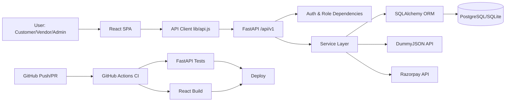

# Ecom Project Presentation Material

## How To Use This File
1. Use the `Slide Content` section as-is on your slides (minimal bullet points).
2. Use the `Speaker Notes` section while presenting (expanded explanation).
3. Use `Visual Suggestion` to decide what screenshot/diagram to show.
4. Keep each slide to 1.5-2.5 minutes for a clean 10-12 minute presentation.

---

## Slide 1: Objective of This Project

### Slide Content (Minimal)
- Build a complete e-commerce platform (frontend + backend)
- Enable customer, vendor, and admin workflows
- Ensure production-ready deployment with CI/CD
- Support secure auth, payments, and catalog operations
- Demonstrate real-world full-stack engineering

### Speaker Notes (What to Say)
This project was built to create a practical, production-style e-commerce platform, not just a basic CRUD demo. The objective was to implement an end-to-end system where customers can browse products and place orders, vendors can manage/import products, and admins can control catalog and operations.

A second objective was engineering quality: authentication, role-based authorization, API structure, database migrations, containerized deployment, and CI checks before deployment. This project demonstrates how a full-stack solution can move from local development to cloud deployment with reliable workflows.

### Visual Suggestion
- Show home page + quick switch to admin/vendor pages.
- If needed, show repository tree (`fastapi/`, `react/`, CI workflow).

---

## Slide 2: Problem Statement

### Slide Content (Minimal)
- Small teams need one unified commerce system
- Most demo projects lack production readiness
- Need role-based operations (customer/vendor/admin)
- Need fast product onboarding (DummyJSON/manual import)
- Need deployable architecture with real payment flow support

### Speaker Notes (What to Say)
The problem this project addresses is that many sample e-commerce apps are either frontend-only, backend-only, or not ready for real deployment. Real projects need multiple user roles, secure login, proper cart and order lifecycle, and payment integration paths.

This application solves that by unifying storefront and operations in one platform:
1. Customer journeys: browse, cart, checkout, pay, review.
2. Vendor/Admin journeys: manage products, categories, coupons, and order operations.
3. Data onboarding: quick product import from DummyJSON or JSON payload.
4. Engineering operations: migrations, seed strategy, Docker runtime, and CI automation.

The practical use of this application is as a deployable template for e-commerce MVPs or an academic/portfolio project that reflects real software delivery standards.

### Visual Suggestion
- Show login screen + role-based route access.
- Show product import panel (`/vendor/products`) and order management panel (`/admin/orders`).

---

## Slide 3: Tech Stack and Why This Stack

### Slide Content (Minimal)
- Backend: FastAPI + SQLAlchemy + Alembic
- Frontend: React + React Router + Vite
- Data: PostgreSQL (prod), SQLite (dev/test)
- Security: JWT + role-based dependencies
- Delivery: Docker + Render/AWS + GitHub Actions CI

### Speaker Notes (What to Say)
This stack was selected for speed, maintainability, and deployment readiness.

Backend:
1. FastAPI gives high performance and clean API design.
2. SQLAlchemy 2.0 provides strong ORM modeling for complex commerce entities.
3. Alembic gives migration control and reproducible schema evolution.

Frontend:
1. React gives component-driven UI and scalable route composition.
2. React Router handles role-protected routes cleanly.
3. Vite gives fast build/dev workflow and simple production bundling.

Data and Security:
1. PostgreSQL is used for production-grade relational consistency.
2. SQLite is used in dev/test for lightweight local workflows.
3. JWT auth keeps APIs stateless and scalable.
4. Role dependencies enforce admin/staff/customer boundaries.

Delivery:
1. Docker standardizes backend runtime.
2. Render/AWS paths cover quick deployment and enterprise-style deployment.
3. GitHub Actions CI validates backend tests and frontend build before deploy.

### Visual Suggestion
- Show `.github/workflows/ci.yml` and Docker startup flow (`docker-entrypoint.sh`).
- Show `fastapi/app/api/router.py` to demonstrate modular endpoint design.

---

## Slide 4: Workflow (Flowchart / Architectural Diagram)

### Slide Content (Minimal)
- Browser client calls React SPA
- React uses API client to call FastAPI (`/api/v1`)
- FastAPI routes -> services -> SQLAlchemy models -> DB
- External integrations: DummyJSON import, Razorpay payment flow
- CI/CD validates project before deployment

### Speaker Notes (What to Say)
The runtime flow is layered:
1. User interacts with React SPA.
2. React API client sends authenticated requests to FastAPI.
3. FastAPI routes handle request validation and authorization.
4. Business logic runs inside service modules (`cart`, `order`, `payment`, `product_import`).
5. SQLAlchemy writes/reads the database.
6. For integrations, backend calls DummyJSON for imports and Razorpay for payment verification/capture.

The delivery flow is:
1. Code push/PR triggers GitHub Actions.
2. Backend tests and frontend build must pass.
3. Deploy to Render/AWS with migration and bootstrap controls.

### Flowchart (You Can Copy This)

### Visual Suggestion
- Use your architecture image (`react/architecture.drawio.png`) and schema image (`schema.drawio.png`).
- If presenting live, keep one diagram static and explain flow left-to-right.

---

## Slide 5: Outcome

### Slide Content (Minimal)
- Successfully built and deployed full-stack commerce app
- Implemented role-based auth and protected workflows
- Added catalog import, cart, checkout, payment, and reviews
- Established CI checks and deployment pipeline
- Produced reusable project template for real deployments

### Speaker Notes (What to Say)
The final outcome is a working deployed application with both customer and operations capabilities. The system supports complete commerce lifecycle features: catalog browsing, cart and checkout, order/payment processing, reviews, and administrative controls.

Technical outcome:
1. Role-based security is working across API and frontend routes.
2. Product ingestion supports both external source import and manual JSON.
3. Migrations and seed/bootstrap flows are automated for deployment consistency.
4. CI now checks backend and frontend health before deployment.

Presentation outcome:
I can demonstrate either snapshot-based evidence or a full live demo. If live internet is stable, showing the running website gives stronger impact than static screenshots.

### Visual Suggestion
- Option A: Show snapshots (Home, Catalog, Checkout, Admin Dashboard, Vendor Import).
- Option B: Live walk-through (preferred):
  1. Login
  2. Browse and add cart
  3. Checkout/order
  4. Admin/vendor operations

---

## Optional Backup Slide (If Asked)

### Risks and Improvements
- Add frontend automated tests (unit/e2e)
- Add observability (metrics/traces/log dashboards)
- Add rate limiting and audit logs
- Add async jobs for notifications and fulfillment
- Extend inventory reservation and cancellation handling

---

## 60-Second Closing Script
This project demonstrates a complete, deployment-ready e-commerce architecture, not just isolated features. It combines a React storefront and operations UI with a FastAPI backend, structured services, secure auth, role-based access, payment pathways, and cloud deployment practices. The implementation is engineered to be practical, extensible, and presentation-ready for real product scenarios.
