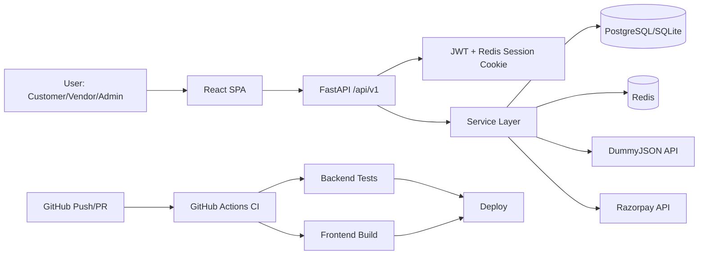

# Ecom Project Presentation Material

This file is structured exactly for your requested 5-slide presentation.

## Slide 1: Objective of This Project

### Slide Content (put on slide)

- Build a complete full-stack e-commerce application
- Support customer, vendor, and admin operations in one system
- Make deployment production-ready with Docker + CI
- Improve performance with Redis sessions and caching
- Integrate real online payments using Razorpay

### Speaker Notes (what to say)

The objective was to go beyond a basic CRUD demo and build a deployable commerce platform. The project combines customer shopping flows with vendor/admin operations, and it includes engineering fundamentals like migrations, CI validation, containerized runtime, and secure payment handling.

A major objective was performance and user experience: Redis-backed sessions/cookies for smoother auth persistence and Redis caching for frequently accessed catalog data.

### Visual Suggestion

- Show home page + admin products page + order payment page quickly.

---

## Slide 2: Problem Statement (Why this app and use case)

### Slide Content (put on slide)

- Many sample projects are not deployment-ready
- Real systems need role-based flows, not only customer pages
- Manual product onboarding is slow without import pipelines
- Payment integrations are often mocked, not production-grade
- Need one architecture that is easy to deploy on low-cost/free plans

### Speaker Notes (what to say)

The problem this project solves is the gap between demo apps and real applications. Typical demos miss role-based controls, proper order/payment lifecycle, and production operations.

This application is useful as:

1. A practical commerce MVP template
2. A portfolio-grade full-stack engineering project
3. A base for small teams that need customer + operations workflows in one system

### Visual Suggestion

- Show vendor/admin product import screen and order workflow.

---

## Slide 3: Tech Stack and Why This Stack

### Slide Content (put on slide)

- Backend: FastAPI, SQLAlchemy, Alembic
- Frontend: React, React Router, Vite
- Data: PostgreSQL (prod), SQLite (local/test)
- Performance: Redis sessions + caching
- Payments: Razorpay (UPI/Card)
- Delivery: Docker, Render/AWS, GitHub Actions CI

### Speaker Notes (what to say)

Why this stack:

1. FastAPI gives clean API development and strong performance.
2. SQLAlchemy + Alembic provide controlled schema evolution.
3. React + Vite gives fast development and stable SPA deployment.
4. Redis improves auth/session handling and catalog response speed.
5. Razorpay integration enables real payment processing with signature verification and webhook reconciliation.
6. Docker + CI make deployments repeatable and safer.

### Visual Suggestion

- Show `.github/workflows/ci.yml` and backend `Dockerfile` quickly.

---

## Slide 4: Workflow (Flowchart / Architecture)

### Slide Content (put on slide)

- Browser -> React SPA -> FastAPI API (`/api/v1`)
- FastAPI -> services -> SQLAlchemy -> DB
- Redis used for session storage and cache
- DummyJSON used for bulk catalog import
- Razorpay used for payment order/create/verify/webhook
- CI runs tests/build before deployment

### Diagram (copy to slide)

### Speaker Notes (what to say)

Explain the architecture left-to-right:

1. UI calls backend via centralized API client.
2. Backend enforces auth/roles, executes business services, persists data.
3. Redis supports session + caching.
4. Payments use Razorpay with verify/webhook safeguards.
5. CI gates deploy quality by running backend tests and frontend build.

### Visual Suggestion

- Show `react/architecture.drawio.png` and `schema.drawio.png` while explaining.

---

## Slide 5: Outcome

### Slide Content (put on slide)

- Full-stack app deployed successfully
- Role-based workflows working end-to-end
- Real Razorpay payment flow integrated
- Redis session/cookie + cache improvements added
- Product import supports DummyJSON and manual JSON
- CI pipeline validates backend and frontend before deployment

### Speaker Notes (what to say)

Final outcome is a working, deployable application with complete customer and operations paths.

Key achievements:

1. Auth and role controls across UI/API
2. Catalog management and bulk import
3. Checkout and real payment integration
4. Session and caching optimization with Redis
5. Deployment-ready structure with CI and Docker

For demonstration, you can show either snapshots or live website. Live demo is stronger if network is stable.

### Visual Suggestion

Live demo order:

1. Login
2. Catalog -> cart -> checkout
3. Order payment screen
4. Vendor/admin import and management screens

---

## Optional Backup Slide (if time permits)

### Future Enhancements

- Add frontend automated tests (unit/e2e)
- Add audit logs and rate limiting
- Add observability dashboards (metrics/traces)
- Add async job queue for notifications/fulfillment

